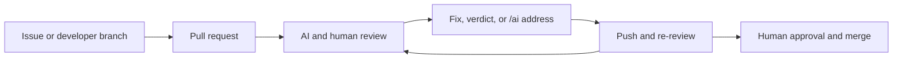

# AI-assisted pull request lifecycle

This guide describes the day-to-day developer experience after a repository
has integrated the shared AI issue implementation, pull request review, and
review-address workflows. It focuses on using those workflows. Repository
administrators should use the linked setup guides for permissions, secrets,
environments, and caller workflow configuration.

The AI workflows assist with implementation and review. They do not approve or
merge pull requests, replace required human review, or override repository
branch protection.

## Lifecycle at a glance



A fully integrated repository has these caller workflows on its default
branch:

- [AI issue implementation](ai-issue-implementation.md), for `/ai implement`.
- [AI pull request review](ai-pr-review.md), for automatic reviews,
  `/ai review`, finding identities, and verdicts.
- [AI PR review address](ai-pr-review-address.md), for `/ai address`, including
  its separate inline-intake continuation workflow.

Command authors must have current `write`, `maintain`, or `admin` repository
permission and must not be bots. Developers without that permission can still
create branches, open pull requests, apply suggestions, and respond to review
feedback through the repository's normal contribution process.

## Command reference

| Command | Post it on | Result |
| --- | --- | --- |
| `/ai implement` | An open issue | Creates a draft implementation pull request, or reports that no change is needed. |
| `/ai implement` followed by guidance | An open issue | Implements the issue with request-specific constraints or context. |
| `/ai review` | An open pull request conversation | Reviews the current head with both enabled AI reviewers. |
| `/ai review` followed by guidance | An open pull request conversation | Reviews the current head with additional focus supplied to both reviewers. |
| `/ai verdict accepted` | A reply to an AI inline finding | Records a structured outcome for that finding. |
| `/ai verdict <finding-id> accepted` | An open pull request conversation | Records a structured outcome using the visible finding ID. |
| `/ai address` | A reply in an inline review thread | Selects that complete thread for implementation. |
| `/ai address` | An open pull request conversation | Addresses eligible feedback for the current head. |
| `/ai address` followed by guidance | An inline thread or pull request conversation | Addresses the selected feedback with additional implementation guidance. |

The verdict outcome in the examples can be `accepted`, `deferred`,
`false-positive`, `out-of-scope`, or `already-fixed`.

## 1. Create a pull request

### Create one normally

Developers can use the usual GitHub flow:

1. Create a branch in the repository or a fork.
2. Implement and test the change.
3. Push the branch and open a pull request.
4. Keep the pull request as a draft until it is ready for review, if desired.

A non-draft pull request from a branch in the same repository starts the
automatic Claude and Codex reviews. Moving a draft pull request to ready for
review also starts them. Draft, Dependabot, and fork pull requests skip the
automatic review, but an authorized maintainer can still request one with
`/ai review`.

### Create one from an issue

An authorized developer can ask Codex to implement an open issue:

```text
/ai implement
```

Good issues state the expected behavior, important constraints, and acceptance
criteria. Add request-specific guidance after the command when the issue alone
does not provide enough direction:

```text
/ai implement

Preserve the public API and add regression coverage for both backends.
```

The workflow:

1. Revalidates the command author and issue state.
2. Checks out the current default-branch revision.
3. Runs Codex without a write-enabled GitHub token.
4. Validates the resulting patch in a separate trusted job.
5. Pushes an `implement-issue-<number>` branch.
6. Opens one draft pull request that closes the issue and summarizes the
   changed paths and validation performed.

If an open pull request already closes the issue, the workflow does not create
another one. If no repository change is needed, it applies the configured
no-PR label and posts an explanation.

After the draft is created, treat it like any other contribution: inspect the
diff, run the relevant tests, make follow-up commits when needed, and mark it
ready only when the implementation is suitable for review.

Changes under `.github/workflows/**` require explicit authorization:

```text
/ai implement --allow-workflow-changes

Keep the workflow change narrowly scoped.
```

The repository must also have the separately configured workflow-push token.
Mentioning the option later in ordinary guidance does not grant permission.

## 2. Review the pull request

### Automatic review

Claude and Codex review eligible pull requests independently. Each reviewer:

- Reviews the exact base and head commit selected for the run.
- Publishes a summary and validated inline comments.
- Restricts inline findings to changed diff hunks.
- Adds a GitHub suggestion when a small replacement is safe and unambiguous.
- Gives every finding a stable `arf_v1_...` identifier.

Pushing another commit produces a `synchronize` event and starts reviews of the
new head. A newer run replaces an older in-progress run for the same reviewer,
while Claude and Codex can continue in parallel.

### Request or focus a review

Post `/ai review` in the pull request conversation to review the current head:

```text
/ai review
```

Use guidance to focus both reviewers:

```text
/ai review

Check backward compatibility and the retry behavior added in the latest push.
```

This is useful when:

- A draft or fork pull request skipped automatic review.
- A maintainer wants a fresh review of the current head.
- The general review needs extra domain or compatibility context.
- A developer wants to verify that a previous finding no longer appears.

The workflow stops publication if the pull request changes while the review is
running. In that case, review the newer run or post the command again after the
branch settles.

### Triage findings

For each AI or human finding, choose the appropriate response:

- Fix the code manually and push a commit.
- Apply a GitHub suggestion and inspect the generated commit.
- Ask Codex to address selected feedback with `/ai address`.
- Explain why no change is appropriate.
- Record a structured verdict for an AI finding.

Reply directly to an AI inline finding to record a verdict:

```text
/ai verdict accepted
```

Or use its visible finding ID in the pull request conversation:

```text
/ai verdict arf_v1_... false-positive
```

Verdicts make review quality measurable; they do not change code, resolve the
GitHub thread, approve the pull request, or replace an explanation to the
reviewer.

| Verdict | Use it when |
| --- | --- |
| `accepted` | The finding is applicable and should be acted on. |
| `deferred` | The finding is valid but will be handled outside this pull request. |
| `false-positive` | The reported problem is not present. |
| `out-of-scope` | The finding is not appropriate for this pull request. |
| `already-fixed` | The current pull request head already contains the correction. |

Human review continues normally. The telemetry records review state, timing,
and comment metadata for workload measurement, but it does not retain
human-authored review or conversation bodies.

## 3. Address review comments

### Address one inline thread

Reply inside an inline review thread:

```text
/ai address
```

That command selects the complete thread. The read-only intake workflow
captures a bounded work item, and a separate continuation from the default
branch runs the privileged reconciliation job. All currently unprocessed
threads explicitly selected this way can be handled together.

Add guidance when the desired resolution is not obvious:

```text
/ai address

Keep the existing public method and fix the behavior internally.
```

### Address the current review round

Post `/ai address` as a top-level pull request conversation comment to address
eligible feedback associated with the current head:

```text
/ai address
```

The workflow considers human and bot-authored conversation comments, submitted
review summaries, and inline comments created at or after GitHub's recorded
push time for that head. This keeps feedback from an older revision from being
silently applied to newer code.

Multiple pending top-level commands and their guidance are reconciled
together. Maintainers can also manually dispatch the review-address workflow
from the default branch with a pull request number.

### What happens next

For a pull request branch in the same repository, the workflow:

1. Revalidates the command, selected feedback, pull request, and exact head.
2. Runs Codex without branch-write credentials.
3. Validates the patch in a separate trusted job.
4. Pushes an automation commit to the existing pull request branch.
5. Updates the pull request description when appropriate.
6. Acknowledges the processed inline and top-level commands.

The workflow never updates a fork branch, creates a replacement pull request,
approves the change, merges it, or resolves review threads automatically. A
no-change result is acknowledged instead of creating an empty commit.

After an automation commit:

1. Inspect the diff rather than assuming every comment was resolved correctly.
2. Run or wait for the repository's required validation.
3. Reply to reviewers when judgment or context is still needed.
4. Resolve threads according to the repository's normal policy.
5. Let the new push trigger automatic AI review, or request a focused
   `/ai review`.

## 4. Finish the review loop

Before merge:

- Confirm required CI checks pass on the final head.
- Confirm requested human changes are addressed or explicitly deferred.
- Record verdicts for important AI findings when possible.
- Check that new AI findings are resolved, explained, or out of scope.
- Obtain all required human approvals.
- Merge using the repository's normal strategy and branch protection.

AI review is advisory. The author and human reviewers remain responsible for
correctness, security, compatibility, tests, and the final merge decision.

## Typical end-to-end example

1. A maintainer posts `/ai implement` on issue `#123`.
2. The workflow opens draft pull request `#456`.
3. The author inspects the implementation, adds a test, and marks it ready.
4. Claude and Codex publish findings on the current head.
5. The author applies one suggestion and replies `/ai address` to a thread that
   needs a broader change.
6. Codex pushes a validated follow-up commit to the same branch.
7. The author records `accepted` or `already-fixed` verdicts for the relevant
   AI findings.
8. The new head receives another AI review and normal repository CI.
9. Human reviewers approve and merge the pull request.

## Troubleshooting

| Symptom | Check |
| --- | --- |
| A command produces no implementation or review run | Confirm the caller workflow is on the default branch, the issue or pull request is open, the command spelling is exact, and the author has write-level permission. |
| Automatic AI review did not start | Check whether the pull request is a draft, comes from a fork, or was opened by Dependabot. Use `/ai review` when appropriate. |
| Review publication stops | The branch may have changed during review. Wait for the newest head and rerun the command if needed. |
| `/ai address` does not push a commit | Confirm the pull request branch belongs to the repository, the head has not changed, and the runtime environment permits the trusted reconciliation run. |
| `/ai implement` cannot open a pull request | Enable GitHub Actions to create pull requests and grant the caller the documented contents, issue, and pull request permissions. |
| A workflow-file change is rejected | Use the explicit `--allow-workflow-changes` form and configure `CODEX_WORKFLOW_PUSH_TOKEN`. |
| Addressing succeeds but a thread remains open | Threads are intentionally not auto-resolved. Inspect the result and resolve the thread manually when appropriate. |
